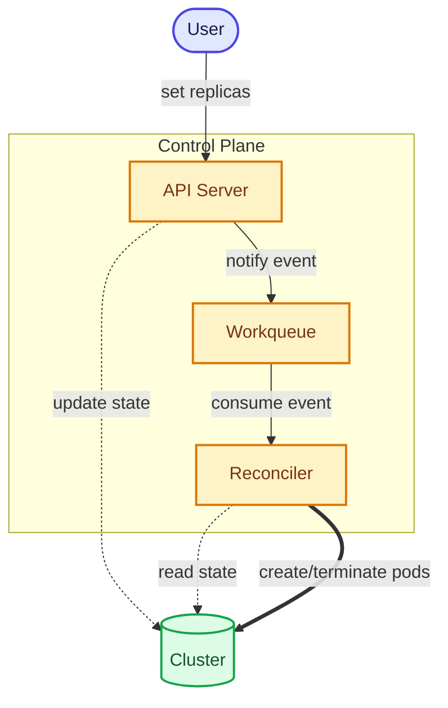
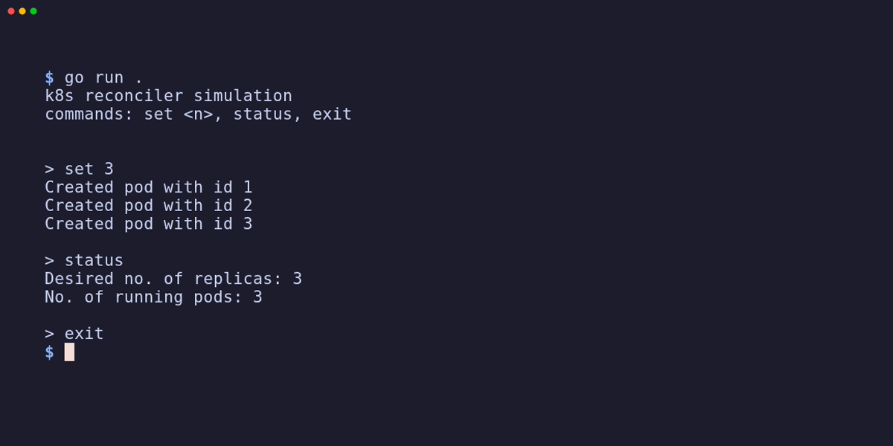

# Kubernetes Reconciler Simulation

A simple, educational simulation of the Kubernetes reconciliation loop built in Go.


## What is this?

This project demonstrates how Kubernetes fundamentally works under the hood. It strips away the complex API machinery and focuses purely on the **Declarative Reconciliation Loop**.

In Kubernetes, you don't imperatively say "create 3 pods". You declare a desired state ("I want 3 replicas"), and the system constantly runs a loop to check: _Does reality match the desired state? If not, fix it._

This project models that exact behavior using pure Go concurrency primitives.

## Architecture

The simulation mirrors the core components of a real Kubernetes cluster:

1. **APIServer**: The entry point for users. It accepts desired state changes and pushes events to a workqueue.
2. **Cluster**: Holds the actual state (running pods) and the desired state (deployment replicas).
3. **Reconciler**: The background loop that watches the workqueue, compares actual vs. desired state, and converges them.



## How it works (The Pseudo Code)

The core magic happens in the reconciler. Notice how it is deliberately "dumb". It doesn't receive complex instructions; it just wakes up, looks at the current state, and makes one small adjustment at a time until the system converges.

```go
func (r *Reconciler) reconcile() {
    for {
        // 1. Read current state
        actualPods, desiredReplicas := r.cluster.State()

        // 2. Diff
        if actualPods == desiredReplicas {
            return // Converged!
        }

        // 3. Act (converge one pod at a time)
        if desiredReplicas > actualPods {
            r.cluster.CreatePod()
        } else {
            r.cluster.TerminatePod()
        }
    }
}
```

This one-at-a-time convergence, combined with re-reading the state in every iteration, ensures the system remains robust even if the desired state changes _while_ it's currently reconciling.

## Running the Simulation

The project includes a simple interactive CLI so you can see reconciliation happening in real time.

```bash
# Clone the repo
git clone https://github.com/eswar-7116/k8s-reconciler.git
cd k8s-reconciler

# Run the simulation
go run .
```



### Commands

- `set <n>`: Set the desired number of replicas to `n`. Watch the reconciler create or terminate pods to match this number.
- `status`: View the current desired vs. running pods.
- `exit`: Gracefully shut down the simulation, ensuring all in-flight reconciliations finish.

## Key Concepts Demonstrated

- **Level-Triggered Logic**: The reconciler doesn't care _what_ changed, only that _something_ changed. It always reads the full current state to figure out what to do.
- **Workqueue Deduplication**: If a user runs `set 5` then immediately `set 10`, the workqueue handles the notifications gracefully without building up a massive backlog, using non-blocking Go channels.
- **Concurrency & Thread Safety**: Managing shared state (`Cluster`) safely across concurrent goroutines (the user input loop vs. the reconciler loop) using `sync.RWMutex`.
- **Graceful Shutdown**: Using `sync.WaitGroup` to ensure the reconciler drains its queue and finishes its work before the program exits.

## Tests

The project includes unit and integration tests that verify convergence logic and ensure thread safety using the Go race detector.

```bash
go test -v -race ./...
```

---

**<p align="center">If you like this project, please consider giving this repo a star 🌟</p>**
